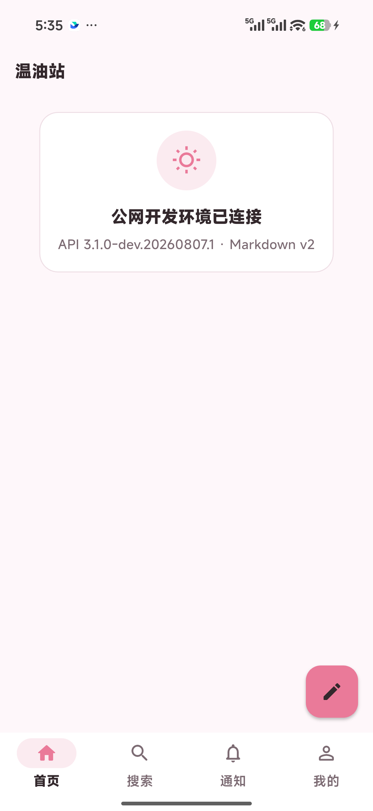
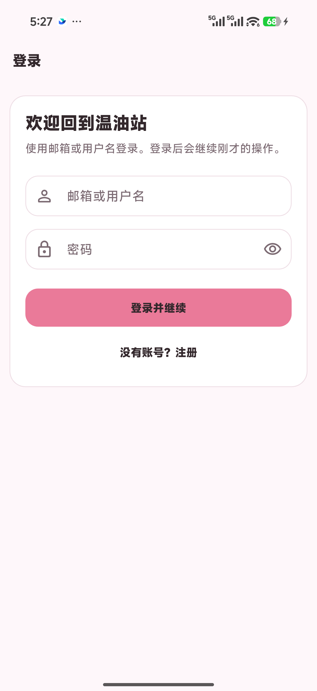
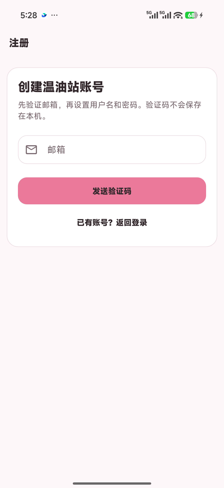

# 粉白视觉设计系统

状态：`active`

本文档是温油站移动端唯一视觉事实源。页面实现必须先复用 `WenyouThemeTokens` 与 `lib/core/widgets/` 中的共享组件；新增视觉模式时，先更新本文档和共享组件，再在业务页面使用。禁止在页面内创建颜色、圆角、间距或状态组件的近似副本。

## 1. 品牌定位

温油站的视觉关键词是：**温暖、轻快、社区感、圆润、信息清楚**。

“粉白 Misskey 风格”指借鉴 Misskey 对信息的组织方式，而不是复制其品牌：浅色背景承载独立面板，弱强调色提示选中和关联，信息密度适中偏紧凑，按压和切换反馈短促。温油站保留自己的品牌粉、中文语气、组件比例与交互路径。

### 反向约束

- 不使用 Misskey Logo、角色、图标、插画、文案或页面截图作为产品资产。
- 不将圆润理解为幼态：避免奶嘴式控件、糖果渐变、过量表情符号和装饰字体。
- 不使用大面积高饱和粉；品牌粉只用于主要动作、焦点、选中与少量图标。
- 不堆叠阴影。背景与面板主要通过底色和细边框分层，只有悬浮创建按钮、弹窗等确有高度关系的元素使用轻阴影。
- 不为了“简洁”牺牲信息：时间、作者、状态、操作关系要能被快速扫读。
- 不在第一阶段加入暗色主题、大范围插画、粒子效果、玻璃拟态或桌面 Deck 布局。

## 2. 官方 Misskey 参考与转译

设计依据来自 Misskey 官方仓库的 `develop` 分支，只提炼可迁移的组织原则：

- [`_light.json5`](https://github.com/misskey-dev/misskey/blob/develop/packages/frontend-shared/themes/_light.json5) 将页面背景、面板、弱强调背景、焦点、分隔线和状态色拆成不同语义；温油站同样使用语义 Token，而不是按页面写颜色。
- [`l-cherry.json5`](https://github.com/misskey-dev/misskey/blob/develop/packages/frontend-shared/themes/l-cherry.json5) 使用暖浅背景、白色面板和克制的樱粉强调，证明粉色主题不需要铺满高饱和色；温油站采用自己的 `#FB7299` 品牌粉和更深的正文色。
- [`style.scss`](https://github.com/misskey-dev/misskey/blob/develop/packages/frontend/src/style.scss) 在窄屏收紧外边距、保持小型字号层级并显式处理焦点；温油站将该原则转为 12/24dp 响应式页边距、系统中文字体和可见焦点。
- [`MkButton.vue`](https://github.com/misskey-dev/misskey/blob/develop/packages/frontend/src/components/MkButton.vue) 与 [`MkInput.vue`](https://github.com/misskey-dev/misskey/blob/develop/packages/frontend/src/components/MkInput.vue) 使用短促的背景/边框反馈和清晰的主次关系；温油站采用 120ms 反馈，但仍遵守 Android 最小 48dp 触控区域。
- [`MkNote.vue`](https://github.com/misskey-dev/misskey/blob/develop/packages/frontend/src/components/MkNote.vue) 按屏宽压缩正文、头像与操作间距；后续用户卡片、主题卡片和操作栏也应响应式降低留白，而不是简单缩小文字。
- [`MkPageHeader.vue`](https://github.com/misskey-dev/misskey/blob/develop/packages/frontend/src/components/global/MkPageHeader.vue) 以紧凑标题、细分隔和低高度维持上下文；温油站应用栏保持清楚、轻量，不加入大面积品牌色顶栏。

这些文件是视觉研究资料，不是 Flutter 实现依赖。不得直接复制其 Vue/CSS、品牌资产或页面结构。

## 3. 颜色与对比度

| 语义 Token | 色值 | 用途 |
| --- | --- | --- |
| `brand` | `#FB7299` | 主按钮、选中图标、焦点边框、少量关键提示 |
| `onBrand` | `#35272C` | 品牌粉上的文字与图标 |
| `background` | `#FFF7FA` | 页面底色 |
| `panel` | `#FFFFFF` | 内容面板、输入框、导航栏 |
| `softPanel` | `#FFF0F5` | 次级区块、中性状态背景 |
| `border` | `#F2DDE5` | 面板、输入框、分隔线 |
| `text` | `#35272C` | 标题和正文 |
| `mutedText` | `#806A73` | 元数据、辅助说明、未选中导航 |
| `accentedBackground` | 品牌粉 15% | 选中态、弱强调区，不承载低对比文字 |
| `focus` | 品牌粉 30% | 键盘/无障碍焦点反馈 |

主按钮必须使用 `brand` 背景与 `onBrand` 前景，两者对比度约 `5.39:1`；禁止改成白字，白色与品牌粉仅约 `2.64:1`。正文与交互文字遵循 WCAG AA：普通文字至少 `4.5:1`，大号文字和非文字控件至少 `3:1`。错误、成功和警告色从全局 `ColorScheme` 读取，页面不得自行定义另一组粉红错误色。

品牌粉不得承担以下职责：整页背景、大段正文、不可交互装饰块、错误提示底色。需要大面积粉色时只能使用 `accentedBackground` 或 `softPanel`。

## 4. 字体与信息层级

使用系统中文字体和 Material Icons，不捆绑品牌字体。

| 层级 | 建议规格 | 使用场景 |
| --- | --- | --- |
| 页面标题 | 22sp / 700 / 1.3 | 登录、注册、空状态标题 |
| 面板标题 | 18sp / 700 / 1.35 | 卡片主标题、主题标题 |
| 区块标题 | 16sp / 700 / 1.35 | 分区、表单小节 |
| 正文 | 14sp / 400 / 1.45 | 说明、帖子正文基线 |
| 强调正文 | 16sp / 400 / 1.45 | 关键引导和短消息 |
| 元数据 | 12sp / 400 / 1.4 | 时间、计数、请求 ID |
| 控件标签 | 14sp / 700 | 按钮、导航和标签动作 |

页面标题和区块标题使用语义 `header`。正文不使用纯粉色；链接或可点击文字必须同时通过位置、图标、下划线或交互语义表达，不能只靠颜色。

## 5. 间距、圆角与触控

唯一间距阶梯为 `4 / 8 / 12 / 16 / 20 / 24 / 32dp`。新增间距必须能说明为什么现有阶梯无法表达，禁止出现 14、18、22 等近似值。

- 360–400dp 宽：页面横向留白 12dp，面板内边距通常 16–20dp。
- 401–599dp 宽：页面横向留白 24dp。
- 600dp 及以上：内容限制最大宽度，保留 24dp 以上外部呼吸空间，不把手机内容机械拉宽。
- 同组字段间 16dp；标题与说明间 8dp；区块间 20–24dp；最小细节间距 4dp。
- 圆角只使用 12、16、20 和胶囊：状态提示 12，输入/按钮 16，主要面板 20，短标签可用胶囊。
- 所有可点击控件最小触控区域为 `48 × 48dp`。图标可以是 20–24dp，但命中区域不得随图标缩小。

## 6. 页面密度与移动布局

首页和主题流优先“扫读效率”，不是展示型大卡片列表。

- 页面背景承载一层主要白色面板；面板内用分隔线、弱面板或留白组织内容，通常不再嵌套完整带边框卡片。
- 一个屏幕应尽量能看到至少两条主题卡片的主要信息。头像、作者、时间、标题/摘要和主操作形成稳定阅读顺序。
- 窄屏先压缩横向间距和操作间隔，再考虑隐藏低优先级说明；不能通过缩小触控区或正文解决拥挤。
- 长标题和用户名允许换行或省略，但操作按钮、验证码和错误信息不能被裁切。
- 底部导航上方保留系统安全区与悬浮按钮空间；输入页面出现键盘时必须可滚动到当前字段和提交按钮。
- 600dp 宽度仍使用居中的单列内容；桌面多栏和 Deck 不属于当前阶段。

## 7. 共享组件规范

### 面板 `WenyouPanel`

白色表面、1dp `border`、20dp 圆角、默认 20dp 内边距且无常驻阴影。用于将表单、空状态或一组强相关内容从页面背景中分离。禁止为了每一行内容都创建面板。

### 区块标题 `WenyouSectionHeader`

标题必须简短、可扫读；副标题说明下一步或约束，不重复标题。右侧只放与整个区块相关的一个轻量动作。

### 状态提示 `WenyouStatusBanner`

中性、强调、错误三种语义。由图标、文字、可选详情和可选动作组成；错误信息保留请求 ID，使用 `liveRegion`，不展示响应正文、Token 或敏感 URL。状态不能只靠颜色区分。

### 异步主按钮 `WenyouAsyncPrimaryButton`

页面每个提交阶段通常只有一个主按钮。提交中禁用重复操作、保留按钮尺寸并显示 20dp 进度；完成或失败后恢复可操作状态。主按钮使用亮粉背景与深色文字。

### 空状态 `WenyouEmptyState`

由弱粉圆形图标容器、标题、说明、可选技术详情和一个动作构成。用于尚无内容、模块占位、启动失败或不兼容；不要用大型插画挤占首屏。

后续真实功能切片按本文档增量加入用户卡片、主题卡片、标签和操作栏。新增组件前先确认现有组件无法组合表达。

### 首页主题卡片

- 卡片使用单层 `WenyouPanel`、16dp 内边距和细边框；卡片内部不再套完整面板。
- 信息顺序固定为 44dp 圆形头像与作者/活跃时间、分类与状态、标题/摘要、固定比例封面、标签、成员/玩家/回复/加油计数。
- 摘要最多四行，封面最多三张且容器比例在加载前固定；失败图片显示破图图标，不能造成布局跳动。
- 分类、状态和标签使用弱面板胶囊，只有招募、置顶或加油等少量重点使用品牌强调；卡片不以整块粉色区分状态。
- 尚未接入真实详情路由时，卡片不得提供无效点击或伪按钮；接入后整卡命中区至少 48dp，并提供明确读屏标签。

## 8. 组件与交互状态

- **默认**：白色/弱面板底，细边框，正文深色。
- **按压**：使用轻微涟漪或弱强调背景，约 120ms；不做大幅缩放和弹跳。
- **焦点**：2dp 品牌粉边框或等价可见焦点，不能只改变阴影。
- **选中**：品牌色图标/文字配 15% 弱粉背景；导航不使用整块高饱和粉。
- **禁用**：降低强调度并阻止事件，文字仍可辨认；不能仅把透明度降到不可读。
- **加载**：布局稳定，避免按钮文字消失导致宽高跳动；超过短等待时提供文字语义。
- **空数据**：说明为什么为空以及可执行的下一步；若没有动作，不显示伪按钮。
- **错误**：短句说明用户能做什么，可重试则提供动作；技术细节限请求 ID。

## 9. 图标、头像、图片与动效

- 图标统一使用 Material Icons Rounded，常规视觉尺寸 20–24dp；空状态可用 32dp。
- 头像默认圆形；列表建议 40–46dp，详情可用 56–72dp。缺省头像后续由统一组件提供，页面不得随意放字母圆点。
- 列表图片使用固定圆角和可预测比例；多图网格不得因加载完成造成正文跳动。敏感图、失败图和加载图必须有文字或图标状态。
- 第一阶段只使用 120–180ms 的颜色、边框、透明度和内容切换。避免粒子、连续漂浮、视差、大面积模糊和超过 250ms 的常规反馈。
- 尊重系统“减少动态效果”设置；核心信息和操作不得依赖动画才能出现。

## 10. 正确与错误示例

| 场景 | 正确 | 错误 |
| --- | --- | --- |
| 首页卡片 | 页面粉白底 + 白面板 + 细分隔，动作紧凑排列 | 每条内容多层卡片、粗阴影、巨大留白 |
| 主按钮 | `#FB7299` 背景 + `#35272C` 文字 | 品牌粉配白字，或整页多个同权重粉色按钮 |
| 选中导航 | 品牌图标 + 弱粉指示背景 | 整条导航栏高饱和粉，未选中项对比不足 |
| 错误提示 | 错误图标 + 可行动文案 + 请求 ID | 只显示红色文本、堆栈或服务端响应正文 |
| 表单 | 16dp 圆角、清楚标签、48dp 以上触控 | 用 placeholder 代替标签、字段间距忽大忽小 |
| Misskey 借鉴 | 复用分层、密度、反馈原则 | 复制 Logo、角色、图标和组件源码 |

## 11. 真机参考图

参考设备为 Xiaomi Android 16，使用公网开发 API。图片只记录视觉基线，不记录测试账号、邮箱、Token、请求 ID 或其他私人数据。

应用壳：首页、底部导航和创建入口。

登录：默认表单状态。

注册：邮箱步骤默认状态。

参考图用于发现回归，不代替 360/400/600dp 自动布局测试。屏幕系统栏、字体渲染和系统导航差异不要求像素级一致。

## 12. 变更与验收规则

视觉变更按以下顺序执行：

1. 在本文档定义语义、状态与边界。
2. 更新 `WenyouThemeTokens` 或共享组件，禁止先在业务页试造近似 Token。
3. 在样板页验证，再扩展到真实功能切片。
4. 自动检查关键色对比度、Token 值、48dp 触控和 360/400/600dp 无溢出。
5. 涉及应用壳或关键表单时，在 Xiaomi Android 16 完成真机冒烟并更新参考图。

功能稳定后的视觉精修可以统一调整动效、骨架屏、插画和像素细节，但不得推翻本文档已固定的语义 Token、无障碍和信息密度原则。
